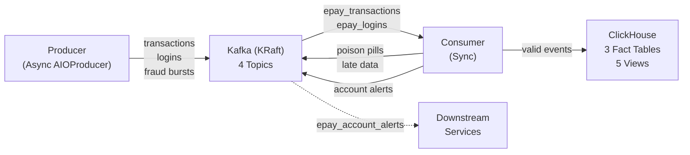

# E-Payment Fraud Detection — Kafka Pub/Sub System

Real-time e-payment fraud detection pipeline built with Kafka (KRaft), ClickHouse, and Python. Demonstrates streaming data engineering patterns including sliding window anomaly detection, dead letter queues, SCD2 dimension modeling, and event-driven alerting.

## Architecture



For the full data lineage with internal processing steps, see [docs/data-lineage.mermaid](docs/data-lineage.mermaid).

## Tech Stack

| Component | Technology | Why |
|-----------|-----------|-----|
| Message Broker | Kafka 7.4 (KRaft mode) | No ZooKeeper dependency, simplified single-node setup |
| OLAP Database | ClickHouse 26.3 | Columnar engine optimized for analytical aggregations |
| Producer | Python + `confluent-kafka` AIOProducer | Async batch sending for higher throughput |
| Consumer | Python + `confluent-kafka` Consumer (sync) | Sequential poll-process-commit for at-least-once guarantee |
| ID Generation | ULID | Lexicographic sort = time-ordered MergeTree performance |
| Schema Validation | Python `@dataclass` | Zero-dependency struct validation via constructor TypeError |

## Quick Start

Prerequisites: Docker and Docker Compose.

```bash
# Start all services
docker compose up --build

# Full reset (wipe volumes)
docker compose down -v && docker compose up --build
```

Once running, verify via:

- **Kafka UI**: http://localhost:8080 — check topics, partitions, consumer lag
- **ClickHouse**: `clickhouse-client` or DBeaver (host: `localhost`, port: `8123`, no password)

```sql
-- Verify data is flowing
SELECT count() FROM fact_transactions;
SELECT count() FROM fact_logins;

-- Check fraud detection results
SELECT * FROM fact_user_status_changes ORDER BY valid_from DESC LIMIT 10;

-- Analytical views
SELECT * FROM view_user_transaction_summary LIMIT 10;
SELECT * FROM view_dim_user_status WHERE is_current = 1;
SELECT * FROM view_hourly_transaction_stats ORDER BY hour DESC LIMIT 24;
SELECT * FROM view_country_transaction_stats ORDER BY transaction_count DESC;
SELECT * FROM view_user_login_countries WHERE distinct_countries > 1;
```

## Key Design Patterns

**Sliding Window Velocity Check** — Uses `collections.deque(maxlen=3)` per user. When 3 transactions occur within 60 seconds, the account is flagged as anomalous. The deque automatically evicts old entries, and `clear_window()` resets after each trigger to prevent duplicate alerts.

**Dead Letter Queue** — Three failure paths route to `epay_dlq`: JSON parse errors, dataclass construction `TypeError` (missing/extra fields), and late data exceeding the 5-minute threshold. Each DLQ message preserves the original payload and error reason for debugging.

**Event-Driven Alerts** — Anomaly detection triggers two parallel actions: writing to `fact_user_status_changes` (analytical record) and publishing to `epay_account_alerts` (real-time notification for downstream services like gateway blocking or SMS alerts).

**SCD2 via Append-Only + View** — ClickHouse is append-optimized and performs poorly with UPDATEs. Instead of maintaining `valid_to` on write, a view uses `LEAD()` window function to dynamically compute it at query time.

**Partition Key = user_id** — Ensures all transactions for a given user land on the same Kafka partition, guaranteeing ordering for the velocity check without requiring cross-instance state sharing.

## Testing

```bash
pip install pytest
pytest tests/ -v
```

29 tests covering the three core business logic modules. All tests run in-memory (no Kafka/ClickHouse dependency), completing in under 0.1 seconds. See [docs/DESIGN_DECISIONS.md](docs/DESIGN_DECISIONS.md#7-testing-strategy) for test design rationale.

## Design Decisions

All design choices are documented with rationale, trade-offs, and interview-ready explanations in [docs/DESIGN_DECISIONS.md](docs/DESIGN_DECISIONS.md). Topics include: KRaft mode, ULID vs UUID, async producer + sync consumer, @dataclass vs Pydantic, regular view vs materialized view, DLQ design, and scalability roadmap.

## Future Improvements

- **Grafana Dashboard** — Connect to ClickHouse analytical views for real-time visualization
- **Micro-batch ClickHouse Inserts** — Buffer N events before insert to reduce write overhead
- **Consumer Horizontal Scaling** — `deploy.replicas: 3` in docker-compose (topics already have 3 partitions)
- **Pydantic Migration** — Upgrade from @dataclass for runtime type validation when stricter schema enforcement is needed
- **Integration Tests** — End-to-end tests with Testcontainers for Kafka + ClickHouse
